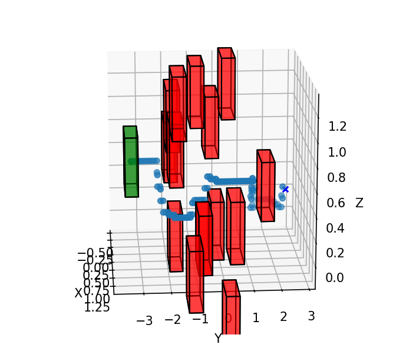
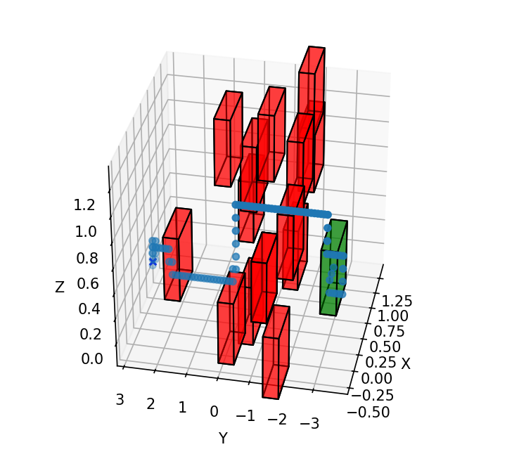

The only dependency is matplotlib you can install by running

`pip install matplotlib`

The algorithm is basically A* algorithm but implemented in 3D.

There are two version currently, which can be toggled using the `use_obs_cost` in `main.py`. 
When set to true the nodes get additional cost from the ostacles [1/(distance from all the obstacles which are ahead)] this cost rewards the path that is far away from the obstacles.

<figure>
    
    <figcaption>Not using Object cost</figcaption>
</figure>

<figure>
    
    <figcaption> Using Object cost</figcaption>

</figure>